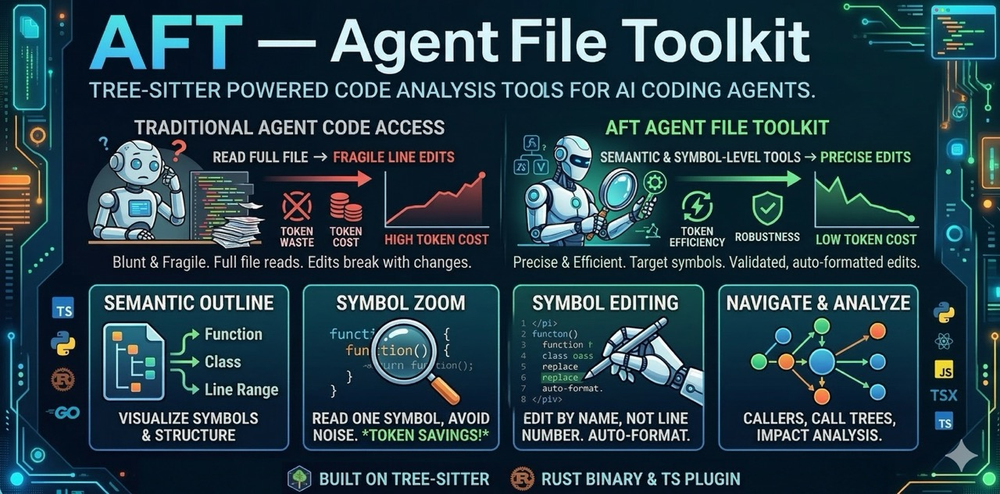

<p align="center">
  
</p>

<h1 align="center">AFT — Agent File Toolkit</h1>

<p align="center">
  <strong>Tree-sitter powered code analysis tools for AI coding agents.</strong><br>
  Semantic editing, call-graph navigation, and structural search — all in one toolkit.
</p>

<p align="center">
  <a href="https://github.com/nandanugg/aft"></a>
  <a href="https://github.com/cortexkit/aft"></a>
  <a href="https://github.com/nandanugg/aft/blob/main/LICENSE"></a>
</p>

<p align="center">
  <a href="#get-started">Get Started</a> ·
  <a href="#accuracy-focused-fork-nandanuggaft">Fork</a> ·
  <a href="#how-it-helps-agents">How it Helps Agents</a> ·
  <a href="#tool-reference">Tool Reference</a> ·
  <a href="#search-benchmarks">Benchmarks</a> ·
  <a href="#supported-languages">Supported Languages</a>
</p>

---

## Get Started

Pick your agent. Each install guide is collapsed below — expand only the one you use.

<details>
<summary><strong>Claude Code</strong> — hook-based tool interception</summary>

Run the install script:

```bash
./scripts/install-claude-hooks.sh
```

This installs:
- **Tool interception hooks** — `Grep` and `Glob` route through AFT for indexed performance; a first-call discovery gate nudges Claude toward semantic tools before raw `Read`/`Search`.
- **CLI wrapper** — the `aft` command is placed on `PATH` for shell use (`aft outline src/`, `aft zoom file sym`, etc.).
- **Session reminder** — a `SessionStart` hook injects AFT's code-discovery protocol at the top of every session.
- **Instructions** — `~/.claude/AFT.md` is added to the global `CLAUDE.md` include chain.

After install, restart Claude Code. See the [Tool Reference](#tool-reference) for every command.

**Uninstall:**

```bash
./scripts/uninstall-claude-hooks.sh
```

</details>

<details>
<summary><strong>Codex</strong> — prompt-injection guidance hooks</summary>

Run the install script:

```bash
./scripts/install-codex-hooks.sh
```

This installs:
- **SessionStart hook** — injects AFT's code-discovery protocol at session start.
- **UserPromptSubmit hook** — nudges the agent toward the right semantic command based on the prompt shape.
- **CLI wrapper** — `aft` command for shell use.
- **Instructions** — `~/.codex/AFT.md` is added to the global `AGENTS.md` include chain.
- **Codex config** — `~/.codex/config.toml` gains `codex_hooks = true` and suppresses the unstable-feature warning.

Codex hooks currently do **not** replace its non-Bash file tools, so this integration teaches
Codex when to call `aft` explicitly via shell rather than transparently intercepting `Read`/`Grep`.

After install, restart Codex. See the [Tool Reference](#tool-reference) for every command.

**Uninstall:**

```bash
./scripts/uninstall-codex-hooks.sh
```

</details>

<details>
<summary><strong>OpenCode</strong> — not published for this fork</summary>

The OpenCode integration lives as an npm package. **This fork has not published an OpenCode
package**, so the plugin-based OpenCode install path is not available here.

If you want AFT inside OpenCode *without* the fork's accuracy features (dispatch edges,
implementation edges, control-flow context, similarity stack, etc.), install the upstream
[cortexkit/aft](https://github.com/cortexkit/aft) OpenCode package:

```bash
bunx @cortexkit/aft-opencode@latest setup
```

That gets you upstream AFT's OpenCode integration, with none of this fork's additions. If you
want this fork's features in OpenCode, either use Claude Code / Codex instead, or let us know
via an issue so publishing priority can go up.

</details>

---

## Accuracy-Focused Fork (nandanugg/aft)

This is a **fork** of the upstream [cortexkit/aft](https://github.com/cortexkit/aft), adding
features driven by one question: *does routing an AI coding agent's code exploration through
richer structural tools actually make its generated documentation more accurate, or just more
verbose?* The answer, after a five-iteration measurement study against two other tools in the
same space, is **yes — and by a measurable margin**.

### The study (brief)

A business-flow documentation task was given to Claude Code running inside three isolated
Docker containers, each configured with exactly one code-navigation tool: this fork, the
[codebase-memory-mcp](https://github.com/DeusData/codebase-memory-mcp) server, and
[Serena](https://github.com/oraios/serena). Each tool produced five independent documentation
passes (15 runs total). Factual claims were extracted from each doc and verified against the
real codebase — a production Go service with 473 files and ~10k symbols.

**Results (lower is better):**

| tool                                 | wrong-rate | stale-oracle catches |
|--------------------------------------|-----------:|---------------------:|
| **nandanugg/aft (this fork, v3)**    | **18.0 %** |                   16 |
| codebase-memory-mcp                  |    20.2 %  |                   12 |
| cortexkit/aft (upstream, baseline)   |    22.6 %  |                    3 |
| Serena                               |    23.7 %  |                    3 |

"Stale-oracle catches" = cases where the agent's doc disagreed with a prior knowledge-base
summary AND the real code sided with the agent. Higher is better — the tool is helping the
agent trust current code over stale priors.

### New structural data the agent gets for free

Every existing command (`aft callers`, `aft call_tree`, `aft trace_to`, `aft zoom`) returns
richer output on this fork without any new command surface:

- **Dispatch / goroutine / defer edge kinds** — call-graph results now distinguish direct calls
  from `go fn()`, `defer fn()`, and function-value registrations.
- **Constant-resolved `nearby_string`** — when a dispatch key is `string(pkg.TypedConst)`, the
  resolved literal shows up in results instead of being silently dropped.
- **Dispatched-via FQN** — every registration edge carries the receiving call's qualified name.
- **Call-context flags** — every caller edge is annotated with `in_defer`, `in_goroutine`,
  `in_loop`, `in_error_branch`, and a `branch_depth`. Derived from SSA dominator analysis.
- **Per-return path conditions** — `aft zoom <file> <func>` now includes a `returns` block
  showing each return statement's path condition (the conjunction of dominating ifs) and the
  returned expression. Critical for documenting retry/error semantics without guessing.
- **Package-level var / const nodes** — show up in `aft outline` as first-class symbols;
  `aft callers` resolves cross-package writes to them.
- **Persistent merged-graph cache** — second invocation on the same tree is ~30× faster. CBOR
  mtime index; no daemon; no behavior change at the agent level, just warm-start latency.
- **Closure-to-handler resolution** — anonymous registration lambdas
  (`mux.HandleFunc("X", func(...) { return Handler(...) })`) resolve through to the inner
  named handler when there's exactly one in-project call in the body. This alone closes the
  async-dispatch accuracy gap measured in the study.

### Steering-layer changes (Claude Code)

- **SessionStart reminder** — injects an AFT code-discovery protocol into every session.
  Biases the agent toward structural tools before raw `Grep`/`Glob`/`Read`, and toward trusting
  the current code over stale prior knowledge.
- **PreToolUse discovery gate** — blocks the *first* raw `Grep|Glob|Read|Search` of a session
  with a nudge toward `aft outline` / `aft trace_to` / `aft callers`. One-shot per session;
  subsequent calls pass through unmolested.

### Design docs and reproduction

Each feature has a design doc under `docs/ADR-*.md` with the SSA mechanics, filter rules,
performance budget, and rollout strategy:

- [ADR-0001-dispatch-edges.md](docs/ADR-0001-dispatch-edges.md) — dispatch, goroutine, defer edges.
- [ADR-0006-call-site-provenance.md](docs/ADR-0006-call-site-provenance.md) — `dispatched_via` FQN + typed-constant resolution.
- [ADR-0002-interface-edges.md](docs/ADR-0002-interface-edges.md) — `aft implementations` + implements edges.
- [ADR-0003-variable-nodes.md](docs/ADR-0003-variable-nodes.md) — var/const outline + cross-package writes.
- [ADR-0007-control-flow-context.md](docs/ADR-0007-control-flow-context.md) — call-context flags + per-return path conditions.
- [ADR-0005-similarity.md](docs/ADR-0005-similarity.md) — tokenize / stem / TF-IDF / synonym dict / co-citation.
- [ADR-0004-persistent-graph.md](docs/ADR-0004-persistent-graph.md) — CBOR cache + incremental updates.

Upstream cortexkit/aft remains the source of everything structural about AFT's core
architecture (tree-sitter parser, edit primitives, Codex integration, etc.). This fork
contributes the extensions above and the accuracy-centered measurement work. Features may or
may not be accepted upstream; this fork stands regardless.

---

## What is AFT?

AFT addresses code by what it *is* — a function, a class, a call site, a symbol — rather than
by line number. It's a two-component system: a Rust binary that does parsing, analysis, edits,
and formatting on top of tree-sitter concrete syntax trees; and a set of agent integrations
(Claude Code hooks, Codex prompt hooks, OpenCode plugin) that expose those operations as tool
calls. Every operation is symbol-aware by default, which makes agent edits stable against
unrelated line shifts and cuts token usage sharply — a file outline is ~10 % of a full read,
and `zoom` on a single function skips everything else.

Details on how each operation is structured live in [**Tool Reference**](#tool-reference).

---

## How it Helps Agents

Three pain points agents hit every session, each solved by one class of tool:

- **Token blow-up** — reading whole files to find one function wastes context.
  Addressed by `aft outline` and `aft zoom`.
- **Line-number fragility** — edits made by line break the moment something above them moves.
  Addressed on the OpenCode plugin surface by symbol-aware `edit`; not available through this
  fork's CLI (see [Tool Reference](#tool-reference)).
- **Blind navigation** — "who calls this?", "what does this break?", "which handler runs for
  this key?" — each would normally mean grep plus a stack of cross-file reads.
  Addressed by `aft callers` / `aft call_tree` / `aft trace_to` / `aft impact`, and on this
  fork specifically by `aft dispatched_by` / `aft dispatches` / `aft implementations`.

Every tool, its invocation, and a sample of its output live in
[Tool Reference](#tool-reference).

---

## Search Benchmarks

With `experimental_search_index: true`, AFT builds a trigram index in the background and serves
grep queries from memory. Here's how it compares to ripgrep on real codebases:

### opencode-aft (253 files)

| Query | ripgrep | AFT | Speedup |
|-------|---------|-----|---------|
| `validate_path` | 31.4ms | 1.48ms | **21x** |
| `BinaryBridge` | 31.0ms | 1.3ms | **24x** |
| `fn handle_grep` | 31.3ms | 0.2ms | **136x** |
| `experimental_search_index` | 31.5ms | 0.4ms | **71x** |

### reth (1,878 Rust files)

| Query | ripgrep | AFT | Speedup |
|-------|---------|-----|---------|
| `impl Display for` | 98.9ms | 1.10ms | **90x** |
| `BlockNumber` | 61.6ms | 2.19ms | **28x** |
| `EthApiError` | 32.7ms | 1.31ms | **25x** |
| `fn execute` | 36.6ms | 2.19ms | **17x** |

### Chromium/base (3,953 C++ files)

| Query | ripgrep | AFT | Speedup |
|-------|---------|-----|---------|
| `WebContents` | 69.5ms | 0.29ms | **236x** |
| `StringPiece` | 51.8ms | 0.78ms | **66x** |
| `NOTREACHED` | 51.6ms | 2.16ms | **24x** |
| `base::Value` | 54.4ms | 1.13ms | **48x** |

Rare queries see the biggest gains — the trigram index narrows candidates to a few files instantly.
High-match queries still benefit from `memchr` SIMD scanning and early termination.

Index builds in ~2s for most projects (under 2K files). Larger codebases like Chromium/base
(~4K files) take ~2 minutes for the initial build. Once built, the index persists to disk for
instant cold starts and stays fresh via file watcher and mtime verification.

---

## Tool Reference

AFT's Rust binary handles ~45 internal operations that share one JSON-RPC-style protocol.
Which of them an agent can reach depends on which integration you installed:

- **Shell (CLI wrapper)** — `aft <verb> <args>` via the `aft` script that
  `install-claude-hooks.sh` / `install-codex-hooks.sh` places on your `PATH`. Positional
  args and flags. This is the surface Claude Code and Codex users of this fork go through.
- **OpenCode plugin (JSON params)** — plugin-registered tools the agent calls with
  structured JSON. Hoisted names (`read`, `write`, `edit`, …) replace OpenCode built-ins;
  `aft_`-prefixed ones add new capabilities. **Not shipped in this fork.** Install upstream
  [cortexkit/aft](https://github.com/cortexkit/aft) to use the OpenCode plugin.

> Line numbers throughout are 1-based (matching editor, git, and compiler conventions).

### Capability table

| Capability | Shell | JSON | In this fork |
|---|---|---|---|
| **Navigation** | | | |
| File structure outline | `aft outline <file\|dir>` | `aft_outline { filePath }` | ✅ CLI |
| Inspect a symbol (with call graph) | `aft zoom <file> <sym>` | `aft_zoom { filePath, symbol }` | ✅ CLI |
| Forward call graph | `aft call_tree <file> <sym>` | `aft_navigate { op:"call_tree" }` | ✅ CLI |
| Reverse call graph | `aft callers <file> <sym>` | `aft_navigate { op:"callers" }` | ✅ CLI |
| How execution reaches a point | `aft trace_to <file> <sym>` | `aft_navigate { op:"trace_to" }` | ✅ CLI |
| How a value flows | `aft trace_data <file> <sym> <expr>` | `aft_navigate { op:"trace_data" }` | ✅ CLI |
| What breaks if this changes | `aft impact <file> <sym>` | `aft_navigate { op:"impact" }` | ✅ CLI |
| **Search / read** | | | |
| File read with line numbers | `aft read <file>` | `read { filePath }` | ✅ CLI |
| Trigram-indexed grep | `aft grep <pattern>` | `grep { pattern }` *(experimental)* | ✅ CLI |
| Indexed glob | `aft glob <pattern>` | `glob { pattern }` *(experimental)* | ✅ CLI |
| Semantic search (embeddings) | — | `aft_search { query, topK }` *(experimental)* | OpenCode-only |
| **Fork-only commands** | | | |
| Who registers this handler | `aft dispatched_by <file> <sym>` | — | ✅ CLI (fork) |
| What handler is at this key | `aft dispatches <key> [--prefix]` | — | ✅ CLI (fork) |
| Who implements this interface | `aft implementations <file> <iface>` | — | ✅ CLI (fork) |
| Who writes this package var | `aft writers <file> <var>` | — | ✅ CLI (fork) |
| Semantically similar symbols | `aft similar <file> <sym> [--top=N] [--dict] [--explain]` | — | ✅ CLI (fork) |
| **Editing** | | | |
| Write / create file | — | `write { filePath, content }` | OpenCode-only |
| Edit by symbol or match | — | `edit { filePath, ... }` | OpenCode-only |
| Multi-file patch | — | `apply_patch { patchText }` | OpenCode-only |
| AST pattern search | — | `ast_grep_search { pattern, lang }` | OpenCode-only |
| AST pattern replace | — | `ast_grep_replace { pattern, rewrite }` | OpenCode-only |
| LSP diagnostics | — | `lsp_diagnostics { filePath }` | OpenCode-only |
| **Refactor / maintenance** | | | |
| Add members, derives, decorators, tags | — | `aft_transform { op, ... }` | OpenCode-only |
| Move symbols, extract / inline functions | — | `aft_refactor { op, ... }` | OpenCode-only |
| Undo, checkpoints, restore | — | `aft_safety { op, ... }` | OpenCode-only |
| Import add / remove / organize | — | `aft_import { op, ... }` | OpenCode-only |
| Git merge conflict viewer | — | `aft_conflicts {}` | OpenCode-only |
| Delete / move file | — | `aft_delete { filePath }` / `aft_move { ... }` | OpenCode-only |

> The entries marked **OpenCode-only** exist in the Rust binary here (they compile), but
> aren't exposed through the CLI wrapper. For those capabilities, install upstream
> [cortexkit/aft](https://github.com/cortexkit/aft) — its OpenCode plugin registers each
> as an MCP tool and upstream's README documents parameters and behavior for every one.

---

### Shell-callable tools (available in this fork)

The rest of this section covers each CLI tool in detail. Every example uses the `aft` script
installed by `install-claude-hooks.sh` or `install-codex-hooks.sh`.

#### aft outline

Gets the structural skeleton of a file or directory — every top-level symbol (functions,
methods, types, vars, consts) with kind, visibility, signature, and line range, but no
function bodies. Run it as a first pass before zooming into a specific symbol; it typically
costs ~10% of the tokens a full file read would.

```bash
aft outline src/auth/session.ts
```

The output is one line per symbol in the order they appear in source:

```
src/auth/session.ts
  E fn    createSession(userId: string, opts?: SessionOpts): Promise<Session> 12:38
  E fn    validateToken(token: string): boolean 40:52
  E fn    refreshSession(sessionId: string): Promise<Session> 54:71
  - fn    signPayload(data: Record<string, unknown>): string 73:80
  E type  SessionOpts 5:10
  E var   SESSION_TTL 3:3
```

`E` means exported, `-` means private. Pointing `aft outline` at a directory returns the same
shape for every file under it.

---

#### aft zoom

Reads the body of a single symbol with call-graph annotations: which functions it calls out
to, and which ones call it. Skips straight to the relevant lines, so you don't spend tokens
on surrounding code.

```bash
aft zoom src/auth/session.ts validateToken
```

Output includes the symbol's body with its `calls_out` / `called_by` lists at the top:

```
src/auth/session.ts:40-52
  calls_out: verifyJwt (src/auth/jwt.ts:8), isExpired (src/auth/utils.ts:15)
  called_by: authMiddleware (src/middleware/auth.ts:22), handleLogin (src/routes/login.ts:45)

  39: /** Validate a JWT token and check expiration. */
  40: export function validateToken(token: string): boolean {
  41:   if (!token) return false;
  42:   const decoded = verifyJwt(token);
  43:   if (!decoded) return false;
  44:   return !isExpired(decoded.exp);
  45: }
```

For Go projects, this fork also surfaces each `return` site's path condition — the conjunction
of `if` branches that have to be true to reach it — so documentation of retry/error semantics
can be precise instead of guessed.

---

#### aft callers

Reverse call graph — every call site across the workspace that lands on the given symbol.
This is the "where is this used?" answer, in one request.

```bash
aft callers src/auth/session.ts validateToken
```

Output groups results by file, showing caller function name and line:

```
callers of validateToken (src/auth/session.ts)  total=3 files=3
  src/middleware/auth.ts (1):
    - authMiddleware:22
  src/routes/login.ts (1):
    - handleLogin:45
  src/routes/api.ts (1):
    - requireAuth:17  ← (depth=2, via authMiddleware)
```

On this fork, each caller edge also carries control-flow flags (`in_defer`, `in_goroutine`,
`in_loop`, `in_error_branch`) and a `branch_depth`, so the agent can tell "main path" calls
apart from "error-recovery branch" calls without reading the caller's body.

---

#### aft call_tree

Forward call graph — the set of functions a given symbol calls, recursively. Mirror image
of `aft callers`.

```bash
aft call_tree src/services/billing.ts processInvoice
```

Output is a hierarchical tree:

```
processInvoice (src/services/billing.ts:45)
├── validateCustomer (src/services/customer.ts:12)
├── calculateTotal (src/services/pricing.ts:88)
│   ├── applyTax (src/services/pricing.ts:134)
│   └── applyDiscount (src/services/pricing.ts:156)
└── writeLedger (src/services/ledger.ts:23)
```

Useful for bounding the blast radius of a change, or for documenting what a function actually
does without reading the body.

---

#### aft trace_to

"How does execution reach this point?" Traces backwards from a known entry point (HTTP
handler, Kafka consumer, main, etc.) to show the call chain that lands on the target.

```bash
aft trace_to store/settlement_store.go Create
```

Output is one or more chain(s), one hop per line:

```
trace_to Create (store/settlement_store.go)
  paths=2
  path 1:
    main.main (main.go:32)
    → server.startHTTPServer (server/http.go:18)
    → handler.HandleCreateSettlement (handler/settlement.go:45)
    → service.CreateSettlement (service/settlement.go:12)
    → store.Create (store/settlement_store.go:125)
  path 2:
    cli.rootCmd.Execute (cmd/root.go:20)
    → cmd.seedCmd.Run (cmd/seed.go:14)
    → service.CreateSettlement (service/settlement.go:12)
    → store.Create (store/settlement_store.go:125)
```

Answers the "why did this handler run" class of question.

---

#### aft trace_data

Data flow: "where did this value come from, where does it go next?" Follows a variable or
expression across assignments, function parameters, and (for a documented set of patterns)
pointer-write intrinsics like `json.Unmarshal`.

```bash
aft trace_data api/handler.go ChargePayment merchantID
```

Output is a hop-by-hop trace of where the value travels:

```
trace_data merchantID (api/handler.go → ChargePayment)
  hop 1 (direct arg):    ChargePayment → billing.Charge(merchantID)
  hop 2 (field access):  billing.Charge → store.GetCustomer(input.MerchantID) [approximate]
  hop 3 (receiver):      store.GetCustomer → (s *Store).Find(merchantID)
```

Hops marked `[approximate]` mean the tracker crossed a lossy construct (field access, struct
wrap, writer intrinsic) — the flow exists, but a specific subfield couldn't be pinned down.
Use `trace_to` for control flow ("why did this run"); use `trace_data` for "where did this
value originate."

---

#### aft impact

Lists what else would need to change if this function's signature changed — transitive reverse
callers plus any code that branches on the function's return value.

```bash
aft impact src/auth/session.ts validateToken
```

```
impact of changing validateToken (src/auth/session.ts)
  direct callers: 3
    authMiddleware (src/middleware/auth.ts:22)
    handleLogin (src/routes/login.ts:45)
    handleRefresh (src/routes/refresh.ts:30)
  transitive callers (depth 2): 7
    ...
  tests touching this symbol: 2
    src/auth/__tests__/session.test.ts
    src/middleware/__tests__/auth.test.ts
```

Good for sizing a refactor before you start.

---

#### aft read

Plain file reading with line numbers. Same semantics as a regular cat, but the output is
line-numbered so the agent can cite `file:line` precisely when describing what it found.

```bash
aft read src/app.ts
aft read src/app.ts 100 30    # 30 lines starting at line 100
```

Output is numbered:

```
   1: import { createApp } from "./app"
   2:
   3: const server = createApp()
   4: server.listen(3000)
```

For symbol-aware reads with call-graph annotations, use `aft zoom` instead.

---

#### aft grep *(experimental)*

Trigram-indexed regex search. The index is built at session start in the background, persisted
to disk for fast cold starts, and kept fresh via a file watcher. Falls back to ripgrep for
out-of-project paths or if the index isn't ready yet. Requires `experimental_search_index:
true` in AFT's config.

```bash
aft grep "handleRequest" src/
```

Matches are grouped by file, sorted newest first:

```
src/server.ts
  42: export async function handleRequest(req: Request) {
  89:     return handleRequest(retryReq)

src/test/server.test.ts
  15: import { handleRequest } from "../server"

Found 3 match(es) across 2 file(s). [index: ready]
```

Files with more than 5 matches show the first 5 and `... and N more`. Lines truncate at 200
chars. Rare queries see the biggest speedups — the trigram index narrows candidates
instantly; see [Search Benchmarks](#search-benchmarks).

---

#### aft glob *(experimental)*

Indexed file discovery. Same index as `aft grep`. Returns relative paths sorted by
modification time, capped at 100 files per query.

```bash
aft glob "**/*.test.ts"
```

Small result sets print as a flat list. Larger sets are grouped by directory:

```
20 files matching **/*.test.ts

src/ (8 files)
  server.test.ts, utils.test.ts, config.test.ts, ...

src/auth/ (4 files)
  login.test.ts, session.test.ts, token.test.ts, permissions.test.ts
```

For content search, use `aft grep`; `aft glob` is for path-only queries.

---

### Fork-only commands

The commands below only exist in this fork. Each is grounded in SSA + CHA data the Go helper
already computes. Full design docs for the semantics — filter rules, edge cases, performance
budgets — live under `docs/ADR-*.md`.

#### aft dispatched_by

Reverse lookup on dispatch edges. Given a handler function — something that gets passed as a
value to a call somewhere (asynq handlers, HTTP handlers, Kafka consumers, gRPC registrations)
— returns every call site that registered it, the dispatch key if one is present, and the
fully qualified name of the receiving call. The FQN lets an agent tell `asynq.HandleFunc`
apart from `redis.Set` or `logger.With` without a library catalog. See
[ADR-0006-call-site-provenance.md](docs/ADR-0006-call-site-provenance.md).

```bash
aft dispatched_by server/asynq_handler.go HandleMerchantSettlementTask
```

```
dispatched_by HandleMerchantSettlementTask (server/asynq_handler.go)  total=1
  - startAsyncQueueServer (server/asynq_server.go:69)
      key=merchant_settlement:merchant_id
      via (*github.com/hibiken/asynq.ServeMux).HandleFunc
```

The query returns empty when the function isn't passed as a value anywhere, or when the
registration goes through something the helper can't statically resolve (reflection, runtime
map lookup, closure with multiple in-project calls).

---

#### aft dispatches

Forward lookup by dispatch key. Given a string that appears as a dispatch-key argument
(asynq task type, HTTP route pattern, Kafka topic, whatever the library uses), returns the
handler or handlers registered under that key. Use `--prefix` to match all keys that start
with a given prefix.

```bash
aft dispatches "merchant_settlement:merchant_id"
aft dispatches "merchant_settlement:" --prefix
```

```
dispatches key=merchant_settlement:merchant_id  total=1
  - HandleMerchantSettlementTask (server/asynq_handler.go)
      registered by startAsyncQueueServer (server/asynq_server.go:69)
      via (*github.com/hibiken/asynq.ServeMux).HandleFunc
```

With `--prefix`, the output is one block per matched key.

---

#### aft implementations

Which concrete types satisfy an interface. Works across same-package and same-file pairs —
upstream filters those, incorrectly assuming tree-sitter resolves them; Go's implements-relation
is structural and needs the type checker. Mocks (paths under `**/mocks/**` and receivers
containing `Mock`) are filtered by default; pass `--include-mocks` to see them. See
[ADR-0002-interface-edges.md](docs/ADR-0002-interface-edges.md).

```bash
aft implementations store/settlement_store.go SettlementStorer
aft implementations store/settlement_store.go SettlementStorer --include-mocks
```

```
implementations of SettlementStorer (store/settlement_store.go)  total=1
  *store.settlementStore  (store):
    - Create (store/settlement_store.go:125)
    - FindOrCreate (store/settlement_store.go:501)
    - ListByMerchantID (store/settlement_store.go:251)
    - BulkInsert (store/settlement_store.go:389)
    ... 39 more methods
```

With `--include-mocks`, generated mock receivers appear alongside the real implementations.

---

#### aft writers

Who writes to a package-level variable or constant, across package boundaries. Same-package
writes are filtered at the helper — tree-sitter already sees those in a single file view.
Init-function writes show up too (SSA models `var X = fn()` as a write from the synthetic
`init()`). See [ADR-0003-variable-nodes.md](docs/ADR-0003-variable-nodes.md).

```bash
aft writers server/registry.go handlerRegistry
```

```
writers handlerRegistry (server/registry.go)  total=2
  server/asynq_server.go (1):
    - startAsyncQueueServer:47
  server/asynq_server.go (1):
    - init:12
```

When the variable is only written from inside its own package, the command reports
`(no cross-package writers found)`. That's the common case for well-encapsulated Go code.

---

#### aft similar

Semantically similar symbols — without an embedding model. Scoring is the weighted sum of
three signals: TF-IDF cosine over tokenized + stemmed identifiers, optional synonym-dict
expansion (load from `.aft/synonyms.toml` at the project root), and call-graph co-citation
(fraction of shared callees). Explainable: `--explain` shows which tokens and shared callees
drove each match's score. See [ADR-0005-similarity.md](docs/ADR-0005-similarity.md).

```bash
aft similar merchant_settlement/service.go SettleMerchantSettlement --top=5
aft similar merchant_settlement/service.go SettleMerchantSettlement --dict --explain
```

Default output is a ranked list:

```
similar to SettleMerchantSettlement (merchant_settlement/service.go)  total=5
   1. 0.850  SettleMerchantSettlement (core_banking_settlement/merchant_settlement/service.go)
   2. 0.759  SettlementSettled (merchant_settlement/http_handler_test.go)
   3. 0.737  TestSettleMerchantSettlement (merchant_settlement/service_test.go)
   4. 0.680  OnHoldMerchantSettlement (merchant_settlement/service.go)
   5. 0.640  settleRealtime (realtime_settlement/service.go)
```

With `--explain`, each match is followed by a scoring breakdown:

```
   1. 0.820  processEarlySettlementV3 (early_settlement/service.go)
       lex=0.65  synonyms=0.00  co_citation=0.81
       tokens: settl=0.42·0.38=0.16  process=0.12·0.25=0.03
       shared callees: FindOrCreateProcessingMerchantSettlement, GetMerchantByID
```

The three components (`lex`, `synonyms`, `co_citation`) sum to the final score. Token
contributions show the stem tokens that drove the lex component with per-side TF-IDF weights
and their product. Shared callees are the in-project functions both sides call, driving the
co-citation score.

Flags: `--top=N` (default 10), `--min-score=F` (default 0.15), `--dict` (load the project
synonym file), `--explain`.

---

---

## Supported Languages

| Language | Outline | Edit | Imports | Refactor |
|----------|---------|------|---------|---------|
| TypeScript | ✓ | ✓ | ✓ | ✓ |
| JavaScript | ✓ | ✓ | ✓ | ✓ |
| TSX | ✓ | ✓ | ✓ | ✓ |
| Python | ✓ | ✓ | ✓ | ✓ |
| Rust | ✓ | ✓ | ✓ | partial |
| Go | ✓ | ✓ | ✓ | partial |
| C | ✓ | ✓ | — | — |
| C++ | ✓ | ✓ | — | — |
| C# | ✓ | ✓ | — | — |
| Zig | ✓ | ✓ | — | — |
| Bash | ✓ | ✓ | — | — |
| HTML | ✓ | ✓ | — | — |
| Markdown | ✓ | ✓ | — | — |

---

## Development

The fork has three build targets:

1. The Rust binary (`crates/aft/`) — tree-sitter parsing, call-graph indexing, similarity index,
   the CLI entry point and every command handler.
2. The Go helper (`go-helper/`) — type-resolved edges via `golang.org/x/tools/go/ssa` +
   class-hierarchy analysis. Emits the new edge kinds this fork adds (dispatch, implements,
   writes, goroutine, defer) plus control-flow context and per-return path conditions.
3. The upstream TypeScript OpenCode plugin (`packages/opencode-plugin/`) — **not published
   from this fork**. Left in the tree for parity with upstream; build only if you're comparing
   against upstream's OpenCode surface.

**Requirements:**

- Rust stable ≥ 1.80
- Go ≥ 1.22 (only if you want `aft-go-helper`; AFT falls back to tree-sitter without it)
- Bun ≥ 1.0 (only for the TypeScript plugin bits; not needed for the CLI surface this fork ships)

**Build everything:**

```sh
# Rust binary
cargo build --release

# Go helper
cd go-helper && go build -o ../target/release/aft-go-helper . && cd ..

# Install the Claude Code / Codex hooks (copies the binaries into ~/.claude/hooks
# and ~/.codex/hooks, writes settings.json, and drops the aft wrapper on PATH).
./scripts/install-claude-hooks.sh
./scripts/install-codex-hooks.sh
```

**Fast iteration while hacking:**

```sh
# Type-check only — 5-10× faster than a release build
cargo check --release

# Compile-check the Go helper
cd go-helper && go build ./... && cd ..

# Run the test suites
cargo test --lib --release         # ~490 Rust unit tests
cd go-helper && go test ./...      # Go helper golden fixtures + unit tests
```

**Project layout:**

```
aft/
├── crates/
│   └── aft/                   # Rust binary, tree-sitter core, all command handlers
│       ├── src/
│       │   ├── commands/      # One module per CLI verb
│       │   ├── callgraph.rs   # Reverse index + dispatch/impl indexes
│       │   ├── similarity.rs  # Tokenize + stem + TF-IDF + co-citation
│       │   ├── persistent_cache.rs  # CBOR-backed warm-start cache (Tier 2)
│       │   └── ...
│       └── tests/             # Integration tests + fixtures
├── go-helper/                 # Go SSA helper — dispatch, implements, writes, returns
│   ├── main.go
│   ├── testdata/              # Golden fixtures per edge kind
│   └── *_test.go
├── docs/
│   ├── helper-contract.md            # Binding schema for helper ↔ Rust JSON
│   ├── ADR-0001-dispatch-edges.md      # Tier 1.1/1.2/1.3
│   ├── ADR-0002-interface-edges.md     # Tier 1.4
│   ├── ADR-0003-variable-nodes.md      # Tier 1.5
│   ├── ADR-0004-persistent-graph.md    # Tier 2 (warm cache)
│   ├── ADR-0005-similarity.md          # Tier 3 (aft similar)
│   ├── ADR-0006-call-site-provenance.md  # dispatched_via + const resolution
│   └── ADR-0007-control-flow-context.md  # caller flags + return-path conditions
├── templates/
│   ├── claude/                # SessionStart reminder + PreToolUse discovery gate
│   ├── codex/                 # SessionStart reminder + UserPromptSubmit guidance
│   └── aft-wrapper.sh         # Shared CLI wrapper template (substituted with binary path)
├── scripts/
│   ├── install-claude-hooks.sh
│   ├── install-codex-hooks.sh
│   ├── uninstall-claude-hooks.sh
│   └── uninstall-codex-hooks.sh
├── benchmarks/                # Per-tier benchmark scripts + recorded results
├── packages/
│   ├── opencode-plugin/       # Upstream TS plugin (not published from this fork)
│   └── npm/                   # Upstream platform-specific binary packages
└── tests/                     # Cross-component test fixtures
```

**Adding a new command:**

1. Design doc first — write `docs/ADR-NNNN-<feature>.md` covering schema, semantics,
   performance budget, and feature flag. Existing docs in `docs/` are the template.
2. Helper side (if Go-specific): extend `go-helper/main.go`; add golden fixtures under
   `go-helper/testdata/<feature>/`; respect the filter-at-source rule in
   `docs/helper-contract.md`.
3. Rust side: new handler under `crates/aft/src/commands/`, wire into
   `crates/aft/src/main.rs` dispatch, add any new schema fields with `#[serde(default)]` for
   backward compat.
4. CLI surface: add a case arm in `scripts/install-claude-hooks.sh`'s shell-wrapper heredoc,
   re-run the installer to regenerate `~/.claude/hooks/aft`.
5. Tests: golden fixtures on both sides, unit tests on the Rust handler, an integration test
   under `crates/aft/tests/integration/`.
6. Benchmark: compare against a real Go project and record under `benchmarks/`.

**Measuring documentation accuracy:**

The fork's accuracy comparison is reproducible. The Dockerfiles and run scripts that produced
the numbers in the [fork section](#accuracy-focused-fork-nandanuggaft) live in a sibling
`aft-compare/` directory in the reference setup — three isolated containers (this fork, cbm,
serena), five passes each, claims extracted by sonnet subagents, verified by an opus
subagent. To reproduce against your own codebase, point the Dockerfile's project mount at it
and rerun.

---

## Roadmap

- Cursor support via hooks
- LSP integration for type-aware symbol resolution (partially implemented)
- Streaming responses for large call trees
- Watch mode for live outline updates

---

## Contributing

Bug reports and pull requests are welcome. For larger changes, open an issue first to discuss
the approach.

The binary protocol is documented in `crates/aft/src/main.rs`. Adding a new command means
implementing it in Rust and adding a corresponding tool definition (or extending an existing one)
in `packages/opencode-plugin/src/tools/`.

Run `bun run format` and `cargo fmt` before submitting. The CI will reject unformatted code.

---

## License

[MIT](LICENSE)
